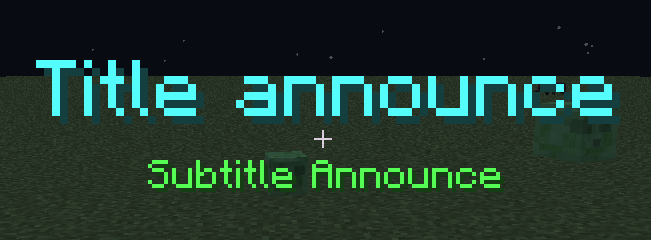
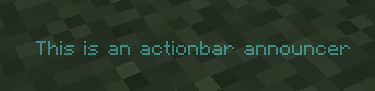
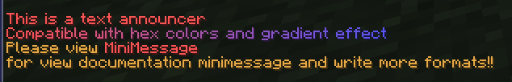
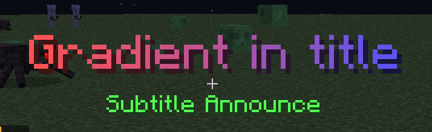
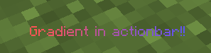
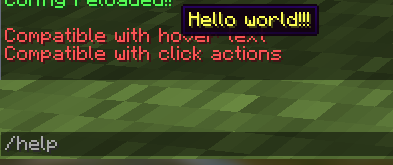

# 📢 MiniAnnouncer

A simple solution for automatic announcements with MiniMessage based on [MessageAnnouncer](https://www.spigotmc.org/resources/5408/) by [clip](https://github.com/extendedclip), 
also adding features such as titles, actionbars, sounds and [MiniMessage format](https://docs.adventure.kyori.net/minimessage#format) to each announcement.

### 🔎 DEPENDENCIES
- PlaceholderAPI

### 💻 COMMANDS
Commands:
- /ma
- /minia
- /announcer
- /miniannouncer

### 💻 SUB-COMMANDS:
- /ma enable - Enable and start announcements.
- /ma disable -  Disable and stop announcements.
- /ma reload - Reload config file.
- /ma info - Show plugin info.
- /ma help - Show all plugin commands.

### 📌 PERMISSION
- miniannouncer.commands - General commands permission

### 🧵 ACTION TAGS
| TAG | FORMAT | EXAMPLE |
| --- | --- | --- |
| MESSAGE | `[MESSAGE] text` | `[MESSAGE] A text message.` |
| ACTIONBAR | `[ACTIONBAR] text` | `[ACTIONBAR] An actionbar message.` |
| SOUND | `[SOUND] sound;volume;pitch` | `[SOUND] ENTITY_EXPERIENCE_ORB_PICKUP;5;5` |
| TITLE | `[TITLE] title;subtitle;fadeIn;stay;fadeOut` | `[TITLE] Title; and Subtitle Announce;5;5;5` |

### 💾 SPOILERS
* Title

* Actionbar

* Chat

* Gradients

* Hover text and actions

* Easy config, go [here](https://github.com/devblook/miniannouncer/blob/master/src/main/resources/config.yml)
